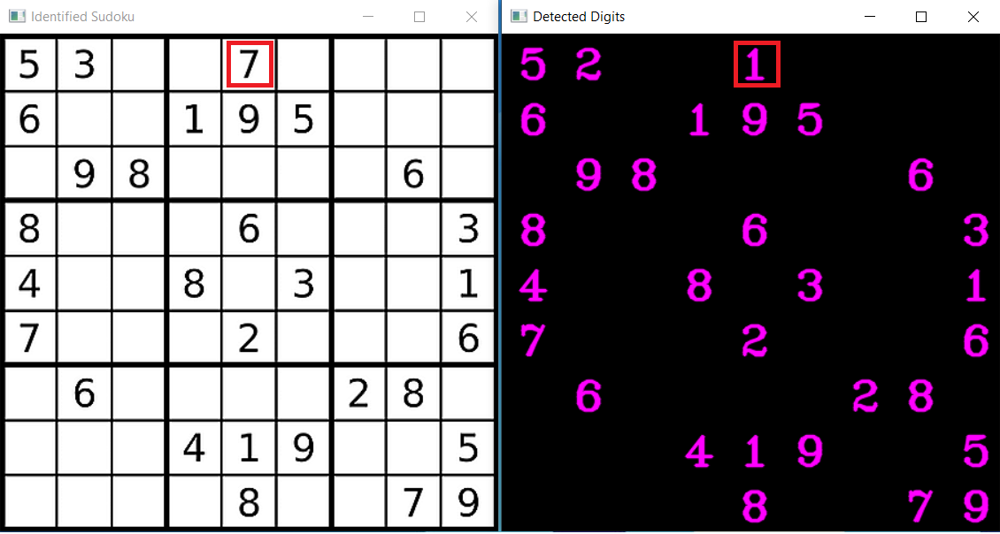

# AI Sudoku Solver

This is a simple program that uses AI and backtracking to solve sudoku problems.

<br>

# Technologies Used

- Programming Language : `Python`
- Machine Learning : `Tensorflow` and `Keras` (For digit recognition)
- Libraries : `Numpy` (for array processing) and `OpenCV` (for image processing)

<br>

# Basic setup

<br>

Clone the project
```bash
  git clone https://github.com/Vishvam10/AI-Sudoku-Solver.git
```

Go to the project directory
```bash
  cd my-project
```

Create a virtual environment in the project folder

```bash
  python3 -m venv /path/to/new/virtual/environment
```

Activate the virtual environment
```bash
  .\venv\Scripts\activate
```

**NOTE :** Please visit this [link](https://www.geeksforgeeks.org/creating-python-virtual-environment-windows-linux/) to know more about installing virtual environments

<br>

Install the dependencies using pip
```bash
  pip install - r requirements.txt
```

Run the program with default options. Add the `-d` to run the program in `debug` mode and `-i` to specify the `image path`  
```bash
  python app.py -i "./Testing_Images/pass_1.jpg" -d
```

<br>

# Features 

- ✅ **Solves sudoku of any difficulty**
- ✅ Works on **any type of image** (`.png`, `.jpg`, etc.)
- ✅ Automatic rescaling and resizing 
- ✅ Errors for unsolvable problems

<br>

# Future Improvements 

- One main thing would be to make it real time. The code for it is pretty straight-forward. All we need to do is pass the **captured frame** as the image input. Something like this :

  ```
  cap = cv2.VideoCapture(0)
  fourcc = cv2.VideoWriter_fourcc(*'XVID')
  flag = 0

  while(True) :
      ret, img = cap.read()
      .
      .

  ```


  While doing so, we need to proceed with the ML model **only when the sudoku board is identified**. And for that, a hard-coded value of image dimensions would not work. I've experimented with realtime but the results were not satisfactory (either the digits were recognized incorrectly or the board was not getting identified). There are ways to mitigate these issues and optimize the whole program. These could be implemented in the near future. 

- **Improving the ML model** : Currently, there are a few cases where 1 or digits are misclassified, which is generally accepted to be normal. But in the case of a sudoku, even 1 misclassification can alter the problem. For example, the image located `./Testing_Images/fail_1.png` fails due to this exact problem :

  